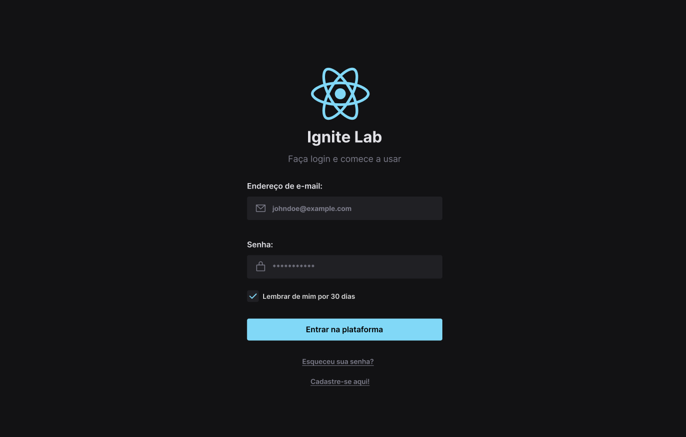
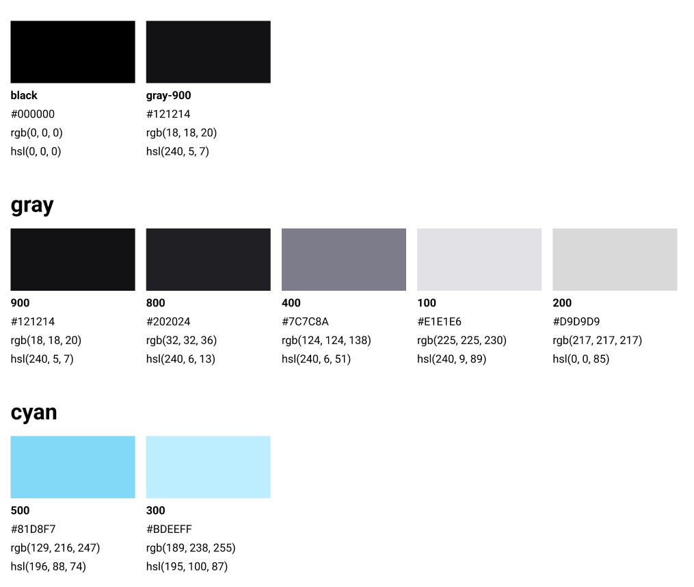
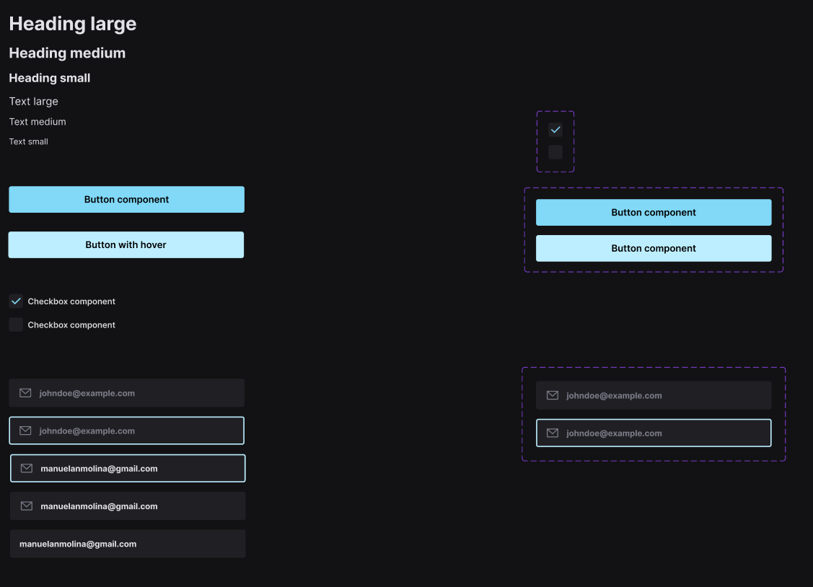

<h1 align="center">
   </> ig.lab | Conteúdo Prático - Design System [5ª Edição]
</h1>

<br/>

## 💻 Projeto
 ...

## 🔖 Layout
 O layout pode ser acessado através do Figma, basta [clicar aqui](https://www.figma.com/file/eRCyvTTo6ZzlHDj4m2WYra/ignite-lab-design-system?node-id=0%3A1)

 <h1 align="center">
    
 </h1>


 <h1 align="center">
   Paleta de Cores
 </h1>

  <h1 align="center">
    
 </h1>

 <h1 align="center">
   Componentes/ Variações
 </h1>

  <h1 align="center">
    
 </h1>


 ## 🚀 Tecnologias

- [ReactJS](https://reactjs.org)
- [Typescript](https://www.typescriptlang.org/)
- [Storybook](https://storybook.js.org/)
- [Radix](https://www.radixeng.com.br/)
- [Figma](https://www.figma.com/)

<br/>


## 🤔 Como posso interagir com projeto?

- Para instalar siga os passos abaixo:

<br/>

```sh
git clone https://github.com/ManuelMolina02/lab-design-system.git
```

Após baixar o projeto, acesse o repositório via terminal e execute os seguintes comandos:

```sh
npm run install
npm run dev
```

Para abrir menu storybook:

```sh
npm run storybook
```

<br/>
<br/>

Feito com 💜 por Manuel Molina 👋 Me contate através do [LinkedIn!](https://www.linkedin.com/in/manuel-angel-berger-molina-ba08b3174/)